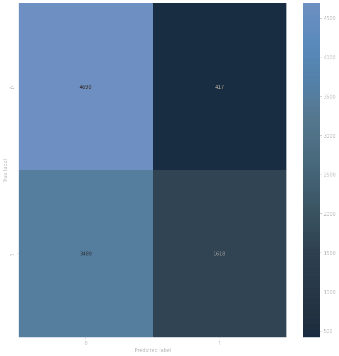

# happy_whale

[happy whale kaggle competition](https://www.kaggle.com/competitions/happy-whale-and-dolphin)

## two steps approach

### 1. Cropping images
./data/crop/...

### 2. Identification model
./model/train.py

confusion matrix: 

best result - tf exp 1.1.5 epoch=11-val_loss=0.6487-val_acc=0.6381.ckpt

p.s. project is under construction ;)